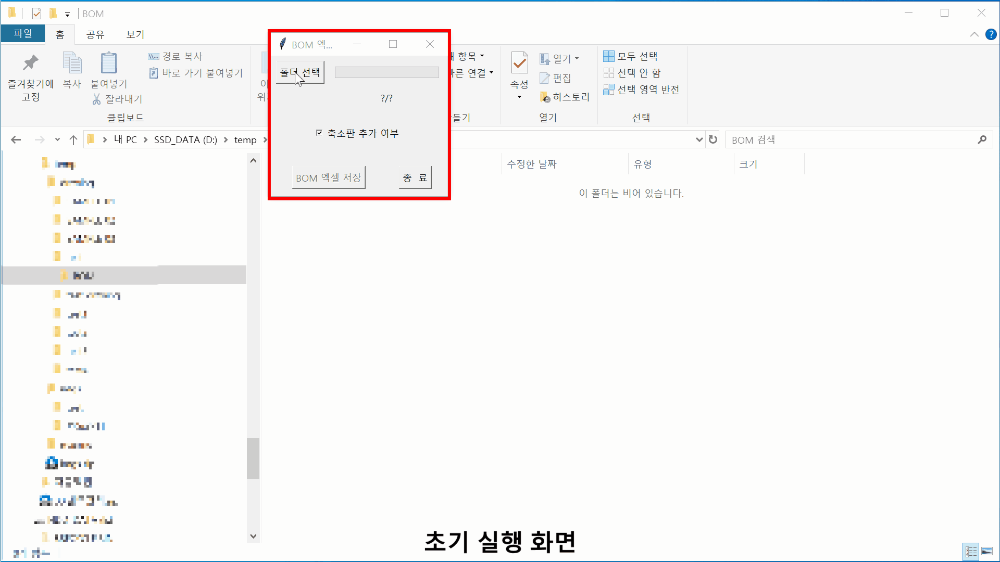
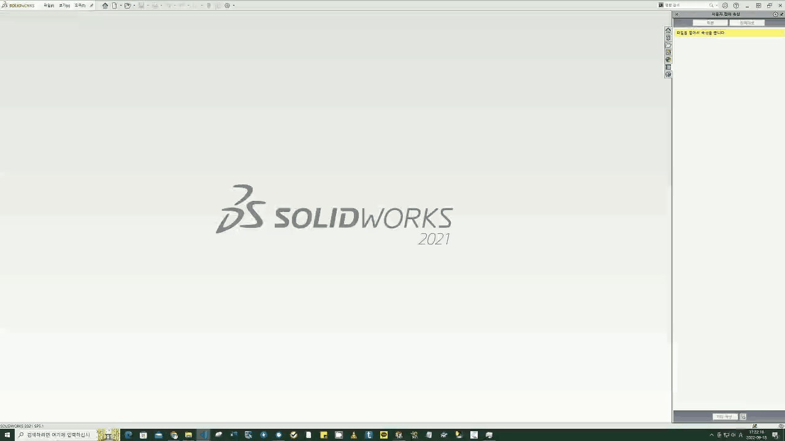

# 중소제조기업 업무 효율화를 위한 자동화 프로그램

------------------------------------------------

## 어셈블리의 BOM 엑셀로 저장하기 자동화
외주 설계를 마치고 고객사에 도면과 엑셀 형식의 BOM을 제공해야 할 때
적게는 수십개에서 수백개의 어셈블리에서 엑셀 내보내기 저장을 해야 합니다.
아래는 이를 자동화한 프로그램의 데모 영상입니다.

## 사용법
- 초기 세팅
  - 실행 파일 및 리소스 파일 다운로드
  - 사용자 환경에 맞춰 리소스 파일 수정
    - 어플리케이션 필요시 이미지 캡처
    - 솔리드웍스 실행 경로 수정
    - 솔리드웍스 사용자 정의에서 아이콘 크기 "대/중/소" 중에 "소"로 세팅
- 자동화 프로그램 실행
- 어셈블리 도면이 위치한 폴더 선택
- 축소판(Thumbnail) 추가 여부 체크
- BOM 엑셀 저장 버튼 클릭
- 솔리드웍스를 실행하면서 BOM을 엑셀로 저장
  - 하위 폴더에 BOM을 폴더 생상
  - 어셈블리 파일을 순차적으로 열고 BOM을 엑셀로 저장
  - 도면 파일에 BOM이 없어서 저장하지 못하는 경우 BOM저장못한파일목록_YYYYMMDD_HHMMSS.txt에 저정
  - BOM을 정비하고 재실행하면 엑셀이 저장되지 않은 어셈블리만 추려서 재실행됨

## 알려진 이슈
- 솔리드웍스가 도면을 열고 닫고를 지속하면 리소스부족 에러 발생하는 문제가 있어 30개 도면 작업 후 솔리드 웍스 재실행 함
  
------------------------------------------------

## DWG 파일 대량 출력 자동화
MCT 기술자들은 DWG 파일을 종이로 출력해서 업무를 진행합니다.
어느 날 설계 도면이 수십장에서 수백장이 한꺼번에 전달 됩니다.
그런데 eDrawingsViewer는 도면을 한꺼번에 출력하는 기능이 없습니다.
아래는 이런 경우 도면이 있는 폴더를 지정해서 반복해서 출력하는 프로그램의 데모 영상입니다.

## 사용법
- 초기 세팅
  - 사용자 PC의 MAC 주소 확인
  - 사용자 PC의 eDrawingViwer 설치 위치 확인
  - 실행 파일 다운로드
- 자동화 프로그램 실행
- DWG 도면이 위치한 폴더 선택
- 출력 버튼 클릭
- eDrawingsViewer를 실행하면서 DWG를 출력
- 정해진 횟수 만큼 출력 후 eDrawingsViewer가 재실행됨

------------------------------------------------

## 구매품 라이브러리 속성 정리
구매품 라이브러리 속성이 지저분하게 관리 되는 경우가 종종 발생합니다.

<table><tr><th>속성</th><th>명칭</th></tr>
<tr><th>제조사</th><th>제조사, Manufacturer, 제조업체, Maker</th></tr>
</table>

이러한 경우 어셈블리를 구성할 때 의도하지 않은 실수를 발생시키고 발생한 문제의 원인 파악을 어렵게 만듭니다. 이러한 문제를 자동화 프로그램으로 2~3년차 경력자가 14개월 걸려서 해야 하는 일을 PC 4대로 병렬 처리한 결과 2주만에 8만여개의 파일을 정리했던 프로그램의 데모 영상입니다.

사용법 2

<ul>
    <li>초기 세팅
        <ul>
            <li>라이브러리 폴더 별로 속성값을 엑셀로 정리</li>
            <li>사용자 환경에 맞춰 리소스 파일 수정</li>
            <li>어플리케이션 필요시 이미지 캡처</li>
        </ul>
    </li>
    <li>솔리드웍스 실행 경로 수정</li>
    <li>솔리드웍스 사용자 정의에서 아이콘 크기 "대/중/소" 중에 "소"로 세팅</li>
    <li>자동화 프로그램 실행</li>
    <li>구매품 라이브러리 파일을 순차적으로 열기</li>
</ul>

